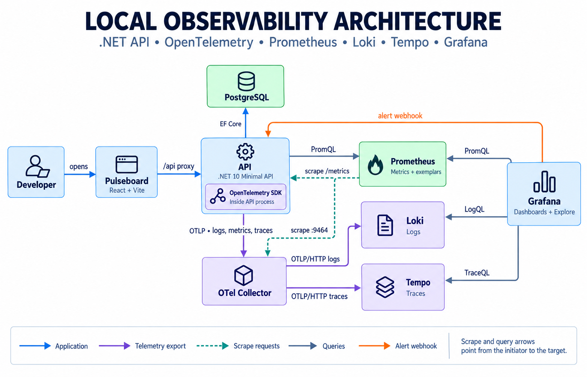

# MonitoringDemo

MonitoringDemo is an end-to-end observability learning environment built with .NET 10, .NET Aspire, React, PostgreSQL, OpenTelemetry, Prometheus, Loki, Tempo, and Grafana. The frontend is branded **Pulseboard** and provides live dashboards for exploring application telemetry and the services that store and query it.

## Architecture



Solid arrows represent runtime traffic or telemetry flow. Dashed arrows represent operator access, configuration, or orchestration. The Collector is the primary application telemetry path: it forwards traces to Tempo and logs to Loki, while Prometheus scrapes both its metrics exporter and the API's native metrics endpoint. The API queries all three backends to populate Pulseboard, and Grafana queries them independently for dashboards and cross-signal investigation.

### Runtime components

| Component | Responsibility |
|---|---|
| **Aspire AppHost** | Loads validated environment settings, starts the database and observability stack, injects service references, waits for dependencies, and exposes local endpoints. |
| **Pulseboard frontend** | React and Vite application with workspace, telemetry, and reference pages. Vite proxies `/api/*` to the API. |
| **API service** | Hosts application endpoints, health checks, telemetry instrumentation, and the Prometheus `/metrics` endpoint. |
| **OpenTelemetry Collector** | Receives OTLP over gRPC or HTTP, applies memory limiting and batching, exports traces to Tempo and logs to Loki, and exposes received metrics in Prometheus format. |
| **PostgreSQL** | Stores application data through Entity Framework Core. Aspire injects the database connection string. |
| **Prometheus** | Scrapes the API and Collector, stores exemplars, evaluates provisioned rules, and serves PromQL queries. |
| **Loki** | Stores OTLP application logs and serves LogQL queries. |
| **Tempo** | Stores distributed traces and serves TraceQL and trace-by-ID queries. |
| **Grafana** | Uses provisioned Prometheus, Loki, and Tempo data sources, dashboards, correlations, annotations, and alerting resources. |
| **Aspire Dashboard** | Shows resource state and development telemetry for the distributed application. |

Telemetry carries correlation, trace, and span identifiers across the application so signals can be followed between Pulseboard, Grafana, Prometheus, Loki, and Tempo.

## Requirements

- .NET SDK 10.0.203 or a compatible later patch
- Node.js 20+
- Docker Desktop or another Docker-compatible container runtime

## Quick start

From the repository root:

```powershell
Copy-Item src/MonitoringDemo.AppHost/.env.example src/MonitoringDemo.AppHost/.env

Push-Location src/MonitoringDemo.Frontend
npm ci
Pop-Location

dotnet run --project src/MonitoringDemo.AppHost
```

Keep the terminal open while Aspire runs the stack. Open the Aspire Dashboard URL printed at startup, or go directly to `http://localhost:5173` for Pulseboard. The default Grafana credentials from the example environment file are `admin` / `change-me`; change them before using the stack outside local development.

## Local services

The example AppHost environment exposes these defaults:

| Service | URL | Notes |
|---|---|---|
| Pulseboard | `http://localhost:5173` | React frontend |
| API | `http://localhost:5000` | Application endpoints |
| API metrics | `http://localhost:5000/metrics` | Native Prometheus scrape endpoint |
| API health | `http://localhost:5000/health` | Dependency health |
| API liveness | `http://localhost:5000/alive` | Process liveness |
| Prometheus | `http://localhost:9090` | PromQL and target status |
| Loki | `http://localhost:3100/ready` | Log store readiness |
| Tempo | `http://localhost:3200/ready` | Trace store readiness |
| Grafana | `http://localhost:3000` | `admin` / configured password |
| Aspire Dashboard | `https://localhost:17225` | Use the launch token from startup output |

Additional telemetry endpoints:

| Endpoint | Default port |
|---|---|
| Tempo OTLP/gRPC | `4317` |
| Tempo OTLP/HTTP | `4318` |
| Collector OTLP/gRPC | `14317` |
| Collector OTLP/HTTP | `14318` |
| Collector Prometheus exporter | `9464` |

All ports, credentials, image tags, retention periods, scrape intervals, and service URLs can be changed in the AppHost `.env` file.

## Configuration

Local `.env` files are ignored by Git. The committed templates document the supported settings for each execution mode:

| Layer | Template | Use |
|---|---|---|
| Aspire stack | `src/MonitoringDemo.AppHost/.env.example` | Full local environment and its public ports |
| API | `src/MonitoringDemo.ApiService/.env.example` | Running the API without Aspire |
| Frontend | `src/MonitoringDemo.Frontend/.env.example` | Running Vite without Aspire |

Shell, IDE, CI, and deployment environment variables take precedence over values loaded from `.env` files. When Aspire runs the project, it supplies the API connection string, service endpoints, and frontend API reference automatically.

## Project structure

```text
src/
|-- MonitoringDemo.AppHost/          Aspire composition root
|   |-- Configuration/               Validated, typed environment settings
|   |-- Orchestration/               Database, observability, and app resources
|   |-- grafana/                     Data sources, dashboards, and alerting
|   |-- loki/                        Log storage configuration
|   |-- otel-collector/              OTLP receivers, processors, and exporters
|   |-- prometheus/                  Scraping, targets, and rules
|   `-- tempo/                       Trace storage configuration
|-- MonitoringDemo.ApiService/       Feature-oriented .NET Minimal API
|   |-- Domain/                      Entities and domain constants
|   |-- Features/                    Vertical API slices and services
|   |-- Hosting/                     Dependency injection and HTTP composition
|   `-- Infrastructure/              Persistence and observability adapters
|-- MonitoringDemo.Frontend/         Pulseboard React application
|   `-- src/
|       |-- app/                     Routing and application entry
|       |-- components/              Shared UI primitives
|       |-- domains/                 Domain dashboards, hooks, services, and types
|       |-- pages/                   Route-level page composition
|       |-- shared/                  Cross-domain components and utilities
|       `-- styles/                  Design tokens and glass UI system
`-- MonitoringDemo.ServiceDefaults/ Shared health, configuration, and telemetry setup
```

## Validation

```powershell
dotnet build MonitoringDemo.slnx
npm --prefix src/MonitoringDemo.Frontend run build
```

## License

For demonstration and learning purposes.
